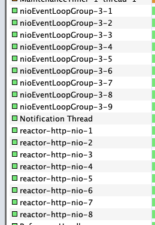
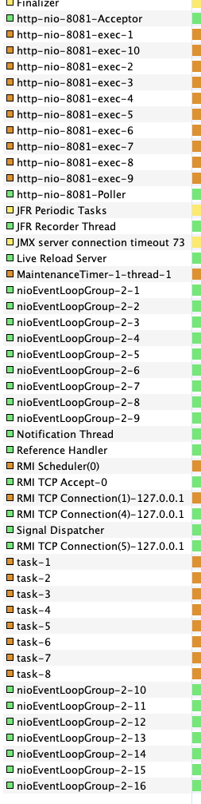
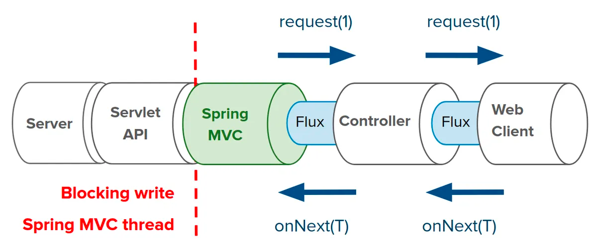
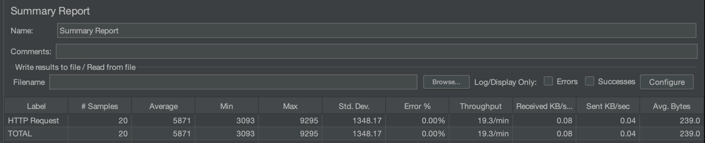
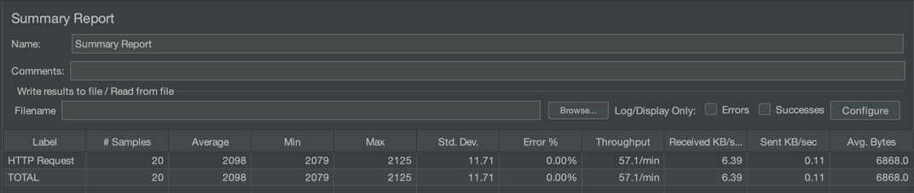
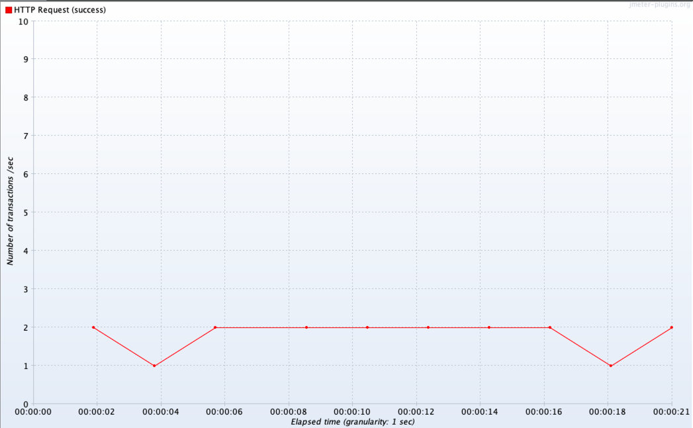

# Spring reactive

# Reference

[Servlet and Reactive Stacks in Spring Framework 5](https://www.infoq.com/articles/Servlet-and-Reactive-Stacks-Spring-Framework-5/)

[Servlet or Reactive Stack: you have choices...](https://www.infoq.com/presentations/spring-servlet-reactive-streams/)

[Reactive Spring Demo](https://github.com/rstoyanchev/demo-reactive-spring)

# Thread diff

## Webflux thread



## Tomcat thread 

- Servlet container request handler thread pool
  - http-nio-8081-exec-0

- Handling reactive flow thread pool
  - nioEventLoopGroup-0-0
  
- In produces stream json handling thread pool
  - task-0



## Tomcat flow



### MVC type single request

`@GetMapping("/cars/block")`  
`fun getCarsBlock(): Car?`  

[Detail log history](README/log/tomcat_mvc_delay_single.log)

```log
[http-nio-8081-exec-1] 48:13:4813 DispatcherServlet: GET "/cars/block", parameters={}
[http-nio-8081-exec-1] 48:13:4813 RequestMappingHandlerMapping: Mapped to me.zeroest.spring.reactive.car.location.controller.CarLocationController#getCarsBlock()
[http-nio-8081-exec-1] 48:13:4813 479: onSubscribe(FluxDelaySubscription.DelaySubscriptionOtherSubscriber)
[http-nio-8081-exec-1] 48:13:4813 479: request(unbounded)
[nioEventLoopGroup-2-11] 48:16:4816 479: onNext(Car(id=1, location=Location(longitude=40.740976, latitude=-73.988004)))
[nioEventLoopGroup-2-11] 48:16:4816 479: onNext(Car(id=4, location=Location(longitude=40.740836, latitude=-73.987992)))
...
[nioEventLoopGroup-2-11] 48:16:4816 479: onNext(Car(id=94, location=Location(longitude=40.740992, latitude=-73.988040)))
[nioEventLoopGroup-2-11] 48:16:4816 479: onNext(Car(id=95, location=Location(longitude=40.740976, latitude=-73.987912)))
[nioEventLoopGroup-2-11] 48:16:4816 479: onComplete()
[http-nio-8081-exec-1] 48:16:4816 RequestResponseBodyMethodProcessor: Using 'application/json', given [*/*] and supported [application/json, application/*+json]
[http-nio-8081-exec-1] 48:16:4816 RequestResponseBodyMethodProcessor: Writing [Car(id=95, location=Location(longitude=40.740976, latitude=-73.987912))]
[http-nio-8081-exec-1] 48:16:4816 DispatcherServlet: Completed 200 OK
```

### MVC type delay multi request

`@GetMapping("/cars/block")`  
`fun getCarsBlock(): Car?`  
`delaySubscription(Duration.ofSeconds(3))`  

- Tomcat thread config

```yml
server:
  tomcat:
    threads:
      max: 1
    accept-count: 0
```

- Client thread config

```
Number of Threads(users): 2
Ramp-up period(seconds): 0
Loop Count: 10
```

Sync 방식으로 block 되어 1개의 tomcat thread를 경합하여 사용  
20개 요청 수 * 3초 지연으로 1분 시간 소요  
같은 동시간에 리퀘스트를 해도 1개의 thread 경합으로 인해 Load time이 6~9초 까지 발생  




---

### WebFlux type single request

- `@GetMapping("/cars")`
- `fun getCars(): Flux<Car>`

[Detail log history](README/log/tomcat_webflux_delay_single.log)

```log
[http-nio-8081-exec-1] 59:20:5920 DispatcherServlet: GET "/cars", parameters={}
[http-nio-8081-exec-1] 59:20:5920 RequestMappingHandlerMapping: Mapped to me.zeroest.spring.reactive.car.location.controller.CarLocationController#getCars()
[http-nio-8081-exec-1] 59:20:5920 480: onSubscribe(FluxDelaySubscription.DelaySubscriptionOtherSubscriber)
[http-nio-8081-exec-1] 59:20:5920 480: request(unbounded)
[http-nio-8081-exec-1] 59:20:5920 WebAsyncManager: Started async request
[http-nio-8081-exec-1] 59:20:5920 DispatcherServlet: Exiting but response remains open for further handling
[nioEventLoopGroup-2-11] 59:22:5922 480: onNext(Car(id=1, location=Location(longitude=40.740976, latitude=-73.988004)))
[nioEventLoopGroup-2-11] 59:22:5922 480: onNext(Car(id=4, location=Location(longitude=40.740836, latitude=-73.987992)))
...
[nioEventLoopGroup-2-11] 59:22:5922 480: onNext(Car(id=94, location=Location(longitude=40.740992, latitude=-73.988040)))
[nioEventLoopGroup-2-11] 59:22:5922 480: onNext(Car(id=95, location=Location(longitude=40.740976, latitude=-73.987912)))
[nioEventLoopGroup-2-11] 59:22:5922 480: onComplete()
[nioEventLoopGroup-2-11] 59:22:5922 WebAsyncManager: Async result set, dispatch to /cars
[http-nio-8081-exec-1] 59:22:5922 DispatcherServlet: "ASYNC" dispatch for GET "/cars", parameters={}
[http-nio-8081-exec-1] 59:22:5922 RequestMappingHandlerAdapter: Resume with async result [[Car(id=1, location=Location(longitude=40.740976, latitude=-73.988004)), Car(id=4, location=Location (truncated)...]
[http-nio-8081-exec-1] 59:22:5922 RequestResponseBodyMethodProcessor: Using 'application/json', given [*/*] and supported [application/json, application/*+json]
[http-nio-8081-exec-1] 59:22:5922 RequestResponseBodyMethodProcessor: Writing [[Car(id=1, location=Location(longitude=40.740976, latitude=-73.988004)), Car(id=4, location=Location (truncated)...]
[http-nio-8081-exec-1] 59:22:5922 DispatcherServlet: Exiting from "ASYNC" dispatch, status 200
```

WebFlux type delay multi request

- `@GetMapping("/cars")`
- `fun getCars(): Flux<Car>`
- `delaySubscription(Duration.ofSeconds(2))`

- Tomcat thread config

```yml
server:
  tomcat:
    threads:
      max: 1
    accept-count: 0
```

- Client thread config

```
Number of Threads(users): 2
Ramp-up period(seconds): 0
Loop Count: 10
```

WebAsyncManager를 통해 tomcat thread는 context를 다른 thread에 위임 따라서 response하기 이전에 다른 request 요청에 사용될 수 있음  
eventLoop thread가 비동기 처리 이후 WebAsyncManager를 통해 다시 dispatch한다  
tomcat thread는 다시 context를 이어받아 response 처리하도록 한다

```log
[http-nio-8081-exec-1] 59:20:5920 WebAsyncManager: Started async request
[http-nio-8081-exec-1] 59:20:5920 DispatcherServlet: Exiting but response remains open for further handling
[nioEventLoopGroup-2-11] 59:22:5922 480: onNext(Car(id=1, location=Location(longitude=40.740976, latitude=-73.988004)))
...
[nioEventLoopGroup-2-11] 59:22:5922 480: onComplete()
[nioEventLoopGroup-2-11] 59:22:5922 WebAsyncManager: Async result set, dispatch to /cars
[http-nio-8081-exec-1] 59:22:5922 DispatcherServlet: "ASYNC" dispatch for GET "/cars", parameters={}
[http-nio-8081-exec-1] 59:22:5922 RequestMappingHandlerAdapter: Resume with async result [[Car(id=1, location=Location(longitude=40.740976, latitude=-73.988004)), Car(id=4, location=Location (truncated)...]
```




---

WebFlux type json stream single request

- `curl -v -X GET -H "Accept:application/stream+json" http://localhost:8081/cars`
- `@GetMapping(path = ["/cars"], produces = ["application/stream+json"])`
- `fun getCarStream(): Flux<Car>`

[Detail log history](README/log/tomcat_webflux_json_stream_single.log)

```log
[http-nio-8081-exec-1] 03:10:310 DispatcherServlet: GET "/cars", parameters={}
[http-nio-8081-exec-1] 03:10:310 RequestMappingHandlerMapping: Mapped to me.zeroest.spring.reactive.car.location.controller.CarLocationController#getCarStream()
[http-nio-8081-exec-1] 03:10:310 481: onSubscribe(FluxUsingWhen.UsingWhenSubscriber)
[http-nio-8081-exec-1] 03:10:310 481: request(1)
[http-nio-8081-exec-1] 03:10:310 WebAsyncManager: Started async request
[http-nio-8081-exec-1] 03:10:310 DispatcherServlet: Exiting but response remains open for further handling
[nioEventLoopGroup-2-11] 03:10:310 481: onNext(Car(id=1, location=Location(longitude=40.740976, latitude=-73.988004)))
[task-33] 03:10:310 481: request(1)
[task-33] 03:10:310 481: onNext(Car(id=4, location=Location(longitude=40.740836, latitude=-73.987992)))
[task-34] 03:10:310 481: request(1)
[nioEventLoopGroup-2-11] 03:10:310 481: onNext(Car(id=5, location=Location(longitude=40.740840, latitude=-73.988048)))
[task-35] 03:10:310 481: request(1)
[task-35] 03:10:310 481: onNext(Car(id=6, location=Location(longitude=40.740888, latitude=-73.988040)))
[task-36] 03:10:310 481: request(1)
...
[nioEventLoopGroup-2-11] 03:10:310 481: onNext(Car(id=100, location=Location(longitude=40.740920, latitude=-73.988048)))
[task-34] 03:10:310 481: request(1)
[task-34] 03:10:310 481: onNext(Car(id=99, location=Location(longitude=40.740980, latitude=-73.987964)))
[task-34] 03:10:310 481: request(1)
[nioEventLoopGroup-2-11] 03:10:310 481: onNext(Car(id=94, location=Location(longitude=40.740992, latitude=-73.988040)))
[task-35] 03:10:310 481: request(1)
[task-35] 03:10:310 481: onNext(Car(id=95, location=Location(longitude=40.740976, latitude=-73.987912)))
[task-35] 03:10:310 481: request(1)
```
