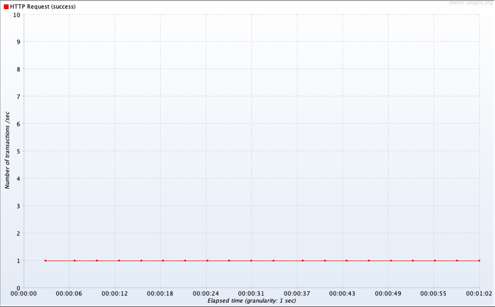

# Spring reactive

# Reference

[[Doc] Spring WebFlux](https://docs.spring.io/spring-framework/docs/current/reference/html/web-reactive.html#spring-webflux)

[Servlet and Reactive Stacks in Spring Framework 5](https://www.infoq.com/articles/Servlet-and-Reactive-Stacks-Spring-Framework-5/)

[Servlet or Reactive Stack: you have choices...](https://www.infoq.com/presentations/spring-servlet-reactive-streams/)

[Reactive Spring Demo](https://github.com/rstoyanchev/demo-reactive-spring)

# Thread diff between Tomcat Netty

## Tomcat thread 

- Servlet container request handler thread pool
  - http-nio-8081-exec-0

- Handling reactive flow thread pool
  - nioEventLoopGroup-0-0
  
- In produces stream json handling thread pool
  - task-0


## Webflux thread


# Flow diff between Tomcat Netty

## Tomcat flow


### MVC type single request

`@GetMapping("/cars/block")`  
`fun getCarsBlock(): Car?`  

[Detail log history](README/log/tomcat_mvc_delay_single.log)

```log
[http-nio-8081-exec-1] 48:13:4813 DispatcherServlet: GET "/cars/block", parameters={}
[http-nio-8081-exec-1] 48:13:4813 RequestMappingHandlerMapping: Mapped to me.zeroest.spring.reactive.car.location.controller.CarLocationController#getCarsBlock()
[http-nio-8081-exec-1] 48:13:4813 479: onSubscribe(FluxDelaySubscription.DelaySubscriptionOtherSubscriber)
[http-nio-8081-exec-1] 48:13:4813 479: request(unbounded)
[nioEventLoopGroup-2-11] 48:16:4816 479: onNext(Car(id=1, location=Location(longitude=40.740976, latitude=-73.988004)))
[nioEventLoopGroup-2-11] 48:16:4816 479: onNext(Car(id=4, location=Location(longitude=40.740836, latitude=-73.987992)))
...
[nioEventLoopGroup-2-11] 48:16:4816 479: onNext(Car(id=94, location=Location(longitude=40.740992, latitude=-73.988040)))
[nioEventLoopGroup-2-11] 48:16:4816 479: onNext(Car(id=95, location=Location(longitude=40.740976, latitude=-73.987912)))
[nioEventLoopGroup-2-11] 48:16:4816 479: onComplete()
[http-nio-8081-exec-1] 48:16:4816 RequestResponseBodyMethodProcessor: Using 'application/json', given [*/*] and supported [application/json, application/*+json]
[http-nio-8081-exec-1] 48:16:4816 RequestResponseBodyMethodProcessor: Writing [Car(id=95, location=Location(longitude=40.740976, latitude=-73.987912))]
[http-nio-8081-exec-1] 48:16:4816 DispatcherServlet: Completed 200 OK
```

### MVC type delay multi request

`@GetMapping("/cars/block")`  
`fun getCarsBlock(): Car?`  
`delaySubscription(Duration.ofSeconds(3))`  

- Tomcat thread config

```yml
server:
  tomcat:
    threads:
      max: 1
    accept-count: 0
```

- Client thread config

```
Number of Threads(users): 2
Ramp-up period(seconds): 0
Loop Count: 10
```

Sync 방식으로 block 되어 1개의 tomcat thread를 경합하여 사용  
20개 요청 수 * 3초 지연으로 1분 시간 소요  
같은 동시간에 리퀘스트를 해도 1개의 thread 경합으로 인해 Load time이 6~9초 까지 발생  




---

### WebFlux type single request

`@GetMapping("/cars")`  
`fun getCars(): Flux<Car>`  

[Detail log history](README/log/tomcat_webflux_delay_single.log)

```log
[http-nio-8081-exec-1] 59:20:5920 DispatcherServlet: GET "/cars", parameters={}
[http-nio-8081-exec-1] 59:20:5920 RequestMappingHandlerMapping: Mapped to me.zeroest.spring.reactive.car.location.controller.CarLocationController#getCars()
[http-nio-8081-exec-1] 59:20:5920 480: onSubscribe(FluxDelaySubscription.DelaySubscriptionOtherSubscriber)
[http-nio-8081-exec-1] 59:20:5920 480: request(unbounded)
[http-nio-8081-exec-1] 59:20:5920 WebAsyncManager: Started async request
[http-nio-8081-exec-1] 59:20:5920 DispatcherServlet: Exiting but response remains open for further handling
[nioEventLoopGroup-2-11] 59:22:5922 480: onNext(Car(id=1, location=Location(longitude=40.740976, latitude=-73.988004)))
[nioEventLoopGroup-2-11] 59:22:5922 480: onNext(Car(id=4, location=Location(longitude=40.740836, latitude=-73.987992)))
...
[nioEventLoopGroup-2-11] 59:22:5922 480: onNext(Car(id=94, location=Location(longitude=40.740992, latitude=-73.988040)))
[nioEventLoopGroup-2-11] 59:22:5922 480: onNext(Car(id=95, location=Location(longitude=40.740976, latitude=-73.987912)))
[nioEventLoopGroup-2-11] 59:22:5922 480: onComplete()
[nioEventLoopGroup-2-11] 59:22:5922 WebAsyncManager: Async result set, dispatch to /cars
[http-nio-8081-exec-1] 59:22:5922 DispatcherServlet: "ASYNC" dispatch for GET "/cars", parameters={}
[http-nio-8081-exec-1] 59:22:5922 RequestMappingHandlerAdapter: Resume with async result [[Car(id=1, location=Location(longitude=40.740976, latitude=-73.988004)), Car(id=4, location=Location (truncated)...]
[http-nio-8081-exec-1] 59:22:5922 RequestResponseBodyMethodProcessor: Using 'application/json', given [*/*] and supported [application/json, application/*+json]
[http-nio-8081-exec-1] 59:22:5922 RequestResponseBodyMethodProcessor: Writing [[Car(id=1, location=Location(longitude=40.740976, latitude=-73.988004)), Car(id=4, location=Location (truncated)...]
[http-nio-8081-exec-1] 59:22:5922 DispatcherServlet: Exiting from "ASYNC" dispatch, status 200
```

### WebFlux type delay multi request

`@GetMapping("/cars")`  
`fun getCars(): Flux<Car>`  
`delaySubscription(Duration.ofSeconds(2))`  

- Tomcat thread config

```yml
server:
  tomcat:
    threads:
      max: 1
    accept-count: 0
```

- Client thread config

```
Number of Threads(users): 2
Ramp-up period(seconds): 0
Loop Count: 10
```

WebAsyncManager를 통해 tomcat thread는 context를 다른 thread에 위임 따라서 response하기 이전에 다른 request 요청에 사용될 수 있음  
eventLoop thread가 비동기 처리 이후 WebAsyncManager를 통해 다시 dispatch한다  
tomcat thread는 다시 context를 이어받아 response 처리하도록 한다

```log
[http-nio-8081-exec-1] 59:20:5920 WebAsyncManager: Started async request
[http-nio-8081-exec-1] 59:20:5920 DispatcherServlet: Exiting but response remains open for further handling
[nioEventLoopGroup-2-11] 59:22:5922 480: onNext(Car(id=1, location=Location(longitude=40.740976, latitude=-73.988004)))
...
[nioEventLoopGroup-2-11] 59:22:5922 480: onComplete()
[nioEventLoopGroup-2-11] 59:22:5922 WebAsyncManager: Async result set, dispatch to /cars
[http-nio-8081-exec-1] 59:22:5922 DispatcherServlet: "ASYNC" dispatch for GET "/cars", parameters={}
[http-nio-8081-exec-1] 59:22:5922 RequestMappingHandlerAdapter: Resume with async result [[Car(id=1, location=Location(longitude=40.740976, latitude=-73.988004)), Car(id=4, location=Location (truncated)...]
```


---

### WebFlux type json stream single request

`curl -v -X GET -H "Accept:application/stream+json" http://localhost:8081/cars`  
`@GetMapping(path = ["/cars"], produces = ["application/stream+json"])`  
`fun getCarStream(): Flux<Car>`  

[Detail log history](README/log/tomcat_webflux_json_stream_single.log)

```log
[http-nio-8081-exec-1] 03:10:310 DispatcherServlet: GET "/cars", parameters={}
[http-nio-8081-exec-1] 03:10:310 RequestMappingHandlerMapping: Mapped to me.zeroest.spring.reactive.car.location.controller.CarLocationController#getCarStream()
[http-nio-8081-exec-1] 03:10:310 481: onSubscribe(FluxUsingWhen.UsingWhenSubscriber)
[http-nio-8081-exec-1] 03:10:310 481: request(1)
[http-nio-8081-exec-1] 03:10:310 WebAsyncManager: Started async request
[http-nio-8081-exec-1] 03:10:310 DispatcherServlet: Exiting but response remains open for further handling
[nioEventLoopGroup-2-11] 03:10:310 481: onNext(Car(id=1, location=Location(longitude=40.740976, latitude=-73.988004)))
[task-33] 03:10:310 481: request(1)
[task-33] 03:10:310 481: onNext(Car(id=4, location=Location(longitude=40.740836, latitude=-73.987992)))
[task-34] 03:10:310 481: request(1)
[nioEventLoopGroup-2-11] 03:10:310 481: onNext(Car(id=5, location=Location(longitude=40.740840, latitude=-73.988048)))
[task-35] 03:10:310 481: request(1)
[task-35] 03:10:310 481: onNext(Car(id=6, location=Location(longitude=40.740888, latitude=-73.988040)))
[task-36] 03:10:310 481: request(1)
...
[nioEventLoopGroup-2-11] 03:10:310 481: onNext(Car(id=100, location=Location(longitude=40.740920, latitude=-73.988048)))
[task-34] 03:10:310 481: request(1)
[task-34] 03:10:310 481: onNext(Car(id=99, location=Location(longitude=40.740980, latitude=-73.987964)))
[task-34] 03:10:310 481: request(1)
[nioEventLoopGroup-2-11] 03:10:310 481: onNext(Car(id=94, location=Location(longitude=40.740992, latitude=-73.988040)))
[task-35] 03:10:310 481: request(1)
[task-35] 03:10:310 481: onNext(Car(id=95, location=Location(longitude=40.740976, latitude=-73.987912)))
[task-35] 03:10:310 481: request(1)
```

## Netty flow


### MVC type block single request

`@GetMapping("/cars/block")`  
`fun getCarsBlock(): Car?`  

[Detail log history](README/log/webflux_mvc_block_single.log)

```log
[reactor-http-nio-4] 37:55:3755 HttpServerOperations: [d2a69954, L:/127.0.0.1:8081 - R:/127.0.0.1:54129] New http connection, requesting read
[reactor-http-nio-4] 37:55:3755 TransportConfig: [d2a69954, L:/127.0.0.1:8081 - R:/127.0.0.1:54129] Initialized pipeline DefaultChannelPipeline{(reactor.left.httpCodec = io.netty.handler.codec.http.HttpServerCodec), (reactor.left.httpTrafficHandler = reactor.netty.http.server.HttpTrafficHandler), (reactor.right.reactiveBridge = reactor.netty.channel.ChannelOperationsHandler)}
[reactor-http-nio-4] 37:55:3755 HttpServerOperations: [d2a69954, L:/127.0.0.1:8081 - R:/127.0.0.1:54129] Increasing pending responses, now 1
[reactor-http-nio-4] 37:55:3755 HttpServer: [d2a69954-1, L:/127.0.0.1:8081 - R:/127.0.0.1:54129] Handler is being applied: org.springframework.http.server.reactive.ReactorHttpHandlerAdapter@6dc3e52c
[reactor-http-nio-4] 37:55:3755 HttpWebHandlerAdapter: [d2a69954-3] HTTP GET "/cars/block"
[reactor-http-nio-4] 37:55:3755 RequestMappingHandlerMapping: [d2a69954-3] Mapped to me.zeroest.spring.reactive.car.location.controller.CarLocationController#getCarsBlock()
[reactor-http-nio-4] 37:55:3755 2: onSubscribe(FluxDelaySubscription.DelaySubscriptionOtherSubscriber)
[reactor-http-nio-4] 37:55:3755 2: request(unbounded)
[reactor-http-nio-4] 37:55:3755 HttpLogging: [d2a69954-3] Resolved [IllegalStateException: block()/blockFirst()/blockLast() are blocking, which is not supported in thread reactor-http-nio-4] for HTTP GET /cars/block
[reactor-http-nio-4] 37:55:3755 AbstractErrorWebExceptionHandler: [d2a69954-3]  500 Server Error for HTTP GET "/cars/block"
java.lang.IllegalStateException: block()/blockFirst()/blockLast() are blocking, which is not supported in thread reactor-http-nio-4
	at reactor.core.publisher.BlockingSingleSubscriber.blockingGet(BlockingSingleSubscriber.java:83)
	Suppressed: reactor.core.publisher.FluxOnAssembly$OnAssemblyException: 
Error has been observed at the following site(s):
	*__checkpoint ⇢ HTTP GET "/cars/block" [ExceptionHandlingWebHandler]
Original Stack Trace:
		at reactor.core.publisher.BlockingSingleSubscriber.blockingGet(BlockingSingleSubscriber.java:83)
		at reactor.core.publisher.Flux.blockLast(Flux.java:2746)
		at me.zeroest.spring.reactive.car.location.controller.CarLocationController.getCarsBlock(CarLocationController.kt:25)
		at java.base/jdk.internal.reflect.NativeMethodAccessorImpl.invoke0(Native Method)
		at java.base/jdk.internal.reflect.NativeMethodAccessorImpl.invoke(NativeMethodAccessorImpl.java:77)
        ...
		at io.netty.channel.DefaultChannelPipeline.fireChannelRead(DefaultChannelPipeline.java:919)
		at io.netty.channel.nio.AbstractNioByteChannel$NioByteUnsafe.read(AbstractNioByteChannel.java:166)
		at io.netty.channel.nio.NioEventLoop.processSelectedKey(NioEventLoop.java:788)
		at io.netty.channel.nio.NioEventLoop.processSelectedKeysOptimized(NioEventLoop.java:724)
		at io.netty.channel.nio.NioEventLoop.processSelectedKeys(NioEventLoop.java:650)
		at io.netty.channel.nio.NioEventLoop.run(NioEventLoop.java:562)
		at io.netty.util.concurrent.SingleThreadEventExecutor$4.run(SingleThreadEventExecutor.java:997)
		at io.netty.util.internal.ThreadExecutorMap$2.run(ThreadExecutorMap.java:74)
		at io.netty.util.concurrent.FastThreadLocalRunnable.run(FastThreadLocalRunnable.java:30)
		at java.base/java.lang.Thread.run(Thread.java:833)
[reactor-http-nio-4] 37:55:3755 HttpLogging: [d2a69954-3] Encoding [{timestamp=Sun Jan 08 23:37:55 KST 2023, path=/cars/block, status=500, error=Internal Server Error,  (truncated)...]
[reactor-http-nio-4] 37:55:3755 HttpServerOperations: [d2a69954-1, L:/127.0.0.1:8081 - R:/127.0.0.1:54129] Decreasing pending responses, now 0
[reactor-http-nio-4] 37:55:3755 HttpServerOperations: [d2a69954-1, L:/127.0.0.1:8081 - R:/127.0.0.1:54129] Last HTTP packet was sent, terminating the channel
[reactor-http-nio-4] 37:55:3755 HttpWebHandlerAdapter: [d2a69954-3] Completed 500 INTERNAL_SERVER_ERROR
[reactor-http-nio-4] 37:55:3755 HttpServerOperations: [d2a69954-1, L:/127.0.0.1:8081 - R:/127.0.0.1:54129] Last HTTP response frame
[reactor-http-nio-3] 37:55:3755 ServerTransport: [28f3477e, L:/127.0.0.1:8081 - R:/127.0.0.1:54127] onUncaughtException(SimpleConnection{channel=[id: 0x28f3477e, L:/127.0.0.1:8081 - R:/127.0.0.1:54127]})

[nioEventLoopGroup-3-8] 37:58:3758 2: onNext(Car(id=1, location=Location(longitude=40.740944, latitude=-73.987948)))
[nioEventLoopGroup-3-8] 37:58:3758 2: onNext(Car(id=4, location=Location(longitude=40.740892, latitude=-73.987996)))
...
[nioEventLoopGroup-3-8] 37:58:3758 2: onNext(Car(id=69, location=Location(longitude=40.740824, latitude=-73.987948)))
[nioEventLoopGroup-3-8] 37:58:3758 2: onNext(Car(id=67, location=Location(longitude=40.740812, latitude=-73.987964)))
[nioEventLoopGroup-3-8] 37:58:3758 2: onComplete()
```

### MVC type single request

`@GetMapping("/car")`  
`fun getCar(): Car`  

[Detail log history](README/log/webflux_mvc_delay_single.log)

```log
[reactor-http-nio-2] 09:10:910 HttpServerOperations: [07f437a1, L:/127.0.0.1:8081 - R:/127.0.0.1:54050] New http connection, requesting read
[reactor-http-nio-2] 09:10:910 TransportConfig: [07f437a1, L:/127.0.0.1:8081 - R:/127.0.0.1:54050] Initialized pipeline DefaultChannelPipeline{(reactor.left.httpCodec = io.netty.handler.codec.http.HttpServerCodec), (reactor.left.httpTrafficHandler = reactor.netty.http.server.HttpTrafficHandler), (reactor.right.reactiveBridge = reactor.netty.channel.ChannelOperationsHandler)}
[reactor-http-nio-2] 09:10:910 HttpServerOperations: [07f437a1, L:/127.0.0.1:8081 - R:/127.0.0.1:54050] Increasing pending responses, now 1
[reactor-http-nio-2] 09:10:910 HttpServer: [07f437a1-1, L:/127.0.0.1:8081 - R:/127.0.0.1:54050] Handler is being applied: org.springframework.http.server.reactive.ReactorHttpHandlerAdapter@6dc3e52c
[reactor-http-nio-2] 09:10:910 HttpWebHandlerAdapter: [07f437a1-1] HTTP GET "/car"
[reactor-http-nio-2] 09:10:910 RequestMappingHandlerMapping: [07f437a1-1] Mapped to me.zeroest.spring.reactive.car.location.controller.CarLocationController#getCar()

[reactor-http-nio-2] 09:13:913 ResponseBodyResultHandler: [07f437a1-1] Using 'application/json' given [*/*] and supported [application/json, application/*+json, application/x-ndjson, text/event-stream]
[reactor-http-nio-2] 09:13:913 ResponseBodyResultHandler: [07f437a1-1] 0..1 [me.zeroest.spring.reactive.car.Car]
[reactor-http-nio-2] 09:13:913 HttpLogging: [07f437a1-1] Encoding [Car(id=1, location=Location(longitude=40.740824, latitude=-73.987952))]
[reactor-http-nio-2] 09:13:913 HttpServerOperations: [07f437a1-1, L:/127.0.0.1:8081 - R:/127.0.0.1:54050] Decreasing pending responses, now 0
[reactor-http-nio-2] 09:13:913 HttpServerOperations: [07f437a1-1, L:/127.0.0.1:8081 - R:/127.0.0.1:54050] Last HTTP packet was sent, terminating the channel
[reactor-http-nio-2] 09:13:913 HttpWebHandlerAdapter: [07f437a1-1] Completed 200 OK
[reactor-http-nio-2] 09:13:913 HttpServerOperations: [07f437a1-1, L:/127.0.0.1:8081 - R:/127.0.0.1:54050] Last HTTP response frame
[reactor-http-nio-2] 09:14:914 ServerTransport: [07f437a1, L:/127.0.0.1:8081 - R:/127.0.0.1:54050] onUncaughtException(SimpleConnection{channel=[id: 0x07f437a1, L:/127.0.0.1:8081 - R:/127.0.0.1:54050]})
```

### MVC type delay multi request

`@GetMapping("/car")`  
`fun getCar(): Car`  
`Thread.sleep(3000L)`

- Client thread config

```
Number of Threads(users): 2
Ramp-up period(seconds): 0
Loop Count: 10
```


---

### WebFlux type single request

`@GetMapping("/cars")`  
`fun getCars(): Flux<Car>`  

[Detail log history](README/log/webflux_webflux_delay_single.log)

```log
[reactor-http-nio-2] 07:58:758 HttpServerOperations: [4cd4fab3, L:/127.0.0.1:8081 - R:/127.0.0.1:54211] New http connection, requesting read
[reactor-http-nio-2] 07:58:758 TransportConfig: [4cd4fab3, L:/127.0.0.1:8081 - R:/127.0.0.1:54211] Initialized pipeline DefaultChannelPipeline{(reactor.left.httpCodec = io.netty.handler.codec.http.HttpServerCodec), (reactor.left.httpTrafficHandler = reactor.netty.http.server.HttpTrafficHandler), (reactor.right.reactiveBridge = reactor.netty.channel.ChannelOperationsHandler)}
[reactor-http-nio-2] 07:58:758 HttpServerOperations: [4cd4fab3, L:/127.0.0.1:8081 - R:/127.0.0.1:54211] Increasing pending responses, now 1
[reactor-http-nio-2] 07:58:758 HttpServer: [4cd4fab3-1, L:/127.0.0.1:8081 - R:/127.0.0.1:54211] Handler is being applied: org.springframework.http.server.reactive.ReactorHttpHandlerAdapter@7a988781
[reactor-http-nio-2] 07:58:758 HttpWebHandlerAdapter: [4cd4fab3-1] HTTP GET "/cars"
[reactor-http-nio-2] 07:58:758 RequestMappingHandlerMapping: [4cd4fab3-1] Mapped to me.zeroest.spring.reactive.car.location.controller.CarLocationController#getCars()
[reactor-http-nio-2] 07:58:758 ResponseBodyResultHandler: [4cd4fab3-1] Using 'application/json' given [*/*] and supported [application/json, application/*+json, application/x-ndjson, text/event-stream]
[reactor-http-nio-2] 07:58:758 ResponseBodyResultHandler: [4cd4fab3-1] 0..N [me.zeroest.spring.reactive.car.Car]
[reactor-http-nio-2] 07:58:758 1: onSubscribe(FluxDelaySubscription.DelaySubscriptionOtherSubscriber)
[reactor-http-nio-2] 07:58:758 1: request(1)
[nioEventLoopGroup-3-9] 08:00:80 1: onNext(Car(id=1, location=Location(longitude=40.740848, latitude=-73.987960)))
[nioEventLoopGroup-3-9] 08:00:80 HttpLogging: [4cd4fab3-1] Encoding [Car(id=1, location=Location(longitude=40.740848, latitude=-73.987960))]
[reactor-http-nio-2] 08:00:80 1: request(127)
[reactor-http-nio-2] 08:00:80 1: onNext(Car(id=2, location=Location(longitude=40.740876, latitude=-73.987988)))
[reactor-http-nio-2] 08:00:80 HttpLogging: [4cd4fab3-1] Encoding [Car(id=2, location=Location(longitude=40.740876, latitude=-73.987988))]
[nioEventLoopGroup-3-9] 08:00:80 1: onNext(Car(id=3, location=Location(longitude=40.740852, latitude=-73.988076)))
[nioEventLoopGroup-3-9] 08:00:80 HttpLogging: [4cd4fab3-1] Encoding [Car(id=3, location=Location(longitude=40.740852, latitude=-73.988076))]
...
[nioEventLoopGroup-3-9] 08:00:80 1: onNext(Car(id=65, location=Location(longitude=40.740944, latitude=-73.987940)))
[nioEventLoopGroup-3-9] 08:00:80 HttpLogging: [4cd4fab3-1] Encoding [Car(id=65, location=Location(longitude=40.740944, latitude=-73.987940))]
[nioEventLoopGroup-3-9] 08:00:80 1: onNext(Car(id=66, location=Location(longitude=40.740960, latitude=-73.987972)))
[nioEventLoopGroup-3-9] 08:00:80 HttpLogging: [4cd4fab3-1] Encoding [Car(id=66, location=Location(longitude=40.740960, latitude=-73.987972))]
[reactor-http-nio-2] 08:00:80 1: request(64)
[nioEventLoopGroup-3-9] 08:00:80 1: onNext(Car(id=68, location=Location(longitude=40.740948, latitude=-73.987920)))
[nioEventLoopGroup-3-9] 08:00:80 HttpLogging: [4cd4fab3-1] Encoding [Car(id=68, location=Location(longitude=40.740948, latitude=-73.987920))]
[nioEventLoopGroup-3-9] 08:00:80 1: onNext(Car(id=67, location=Location(longitude=40.740880, latitude=-73.988012)))
[nioEventLoopGroup-3-9] 08:00:80 HttpLogging: [4cd4fab3-1] Encoding [Car(id=67, location=Location(longitude=40.740880, latitude=-73.988012))]
...
[nioEventLoopGroup-3-9] 08:00:80 1: onNext(Car(id=39, location=Location(longitude=40.740956, latitude=-73.988036)))
[nioEventLoopGroup-3-9] 08:00:80 HttpLogging: [4cd4fab3-1] Encoding [Car(id=39, location=Location(longitude=40.740956, latitude=-73.988036))]
[nioEventLoopGroup-3-9] 08:00:80 1: onNext(Car(id=47, location=Location(longitude=40.740844, latitude=-73.987956)))
[nioEventLoopGroup-3-9] 08:00:80 HttpLogging: [4cd4fab3-1] Encoding [Car(id=47, location=Location(longitude=40.740844, latitude=-73.987956))]
[nioEventLoopGroup-3-9] 08:00:80 1: onComplete()
[reactor-http-nio-2] 08:00:80 HttpWebHandlerAdapter: [4cd4fab3-1] Completed 200 OK
[reactor-http-nio-2] 08:00:80 HttpServerOperations: [4cd4fab3-1, L:/127.0.0.1:8081 - R:/127.0.0.1:54211] Last HTTP response frame
[reactor-http-nio-2] 08:00:80 HttpServerOperations: [4cd4fab3-1, L:/127.0.0.1:8081 - R:/127.0.0.1:54211] Decreasing pending responses, now 0
[reactor-http-nio-2] 08:00:80 HttpServerOperations: [4cd4fab3-1, L:/127.0.0.1:8081 - R:/127.0.0.1:54211] Last HTTP packet was sent, terminating the channel
```

### WebFlux type delay multi request

`@GetMapping("/cars")`  
`fun getCars(): Flux<Car>`  
`delaySubscription(Duration.ofSeconds(2))`  

- Client thread config

```
Number of Threads(users): 2
Ramp-up period(seconds): 0
Loop Count: 10
```


---

### WebFlux type json stream single request

`curl -v -X GET -H "Accept:application/stream+json" http://localhost:8081/cars`  
`@GetMapping(path = ["/cars"], produces = ["application/stream+json"])`  
`fun getCarStream(): Flux<Car>`  

[Detail log history](README/log/webflux_webflux_json_stream_single.log)

```log
[reactor-http-nio-5] 24:15:2415 HttpServerOperations: [b7d6c968, L:/127.0.0.1:8081 - R:/127.0.0.1:54255] New http connection, requesting read
[reactor-http-nio-5] 24:15:2415 TransportConfig: [b7d6c968, L:/127.0.0.1:8081 - R:/127.0.0.1:54255] Initialized pipeline DefaultChannelPipeline{(reactor.left.httpCodec = io.netty.handler.codec.http.HttpServerCodec), (reactor.left.httpTrafficHandler = reactor.netty.http.server.HttpTrafficHandler), (reactor.right.reactiveBridge = reactor.netty.channel.ChannelOperationsHandler)}
[reactor-http-nio-5] 24:15:2415 HttpServerOperations: [b7d6c968, L:/127.0.0.1:8081 - R:/127.0.0.1:54255] Increasing pending responses, now 1
[reactor-http-nio-5] 24:15:2415 HttpServer: [b7d6c968-1, L:/127.0.0.1:8081 - R:/127.0.0.1:54255] Handler is being applied: org.springframework.http.server.reactive.ReactorHttpHandlerAdapter@7a988781
[reactor-http-nio-5] 24:15:2415 HttpWebHandlerAdapter: [b7d6c968-22] HTTP GET "/cars"
[reactor-http-nio-5] 24:15:2415 RequestMappingHandlerMapping: [b7d6c968-22] Mapped to me.zeroest.spring.reactive.car.location.controller.CarLocationController#getCarStream()
[reactor-http-nio-5] 24:15:2415 ResponseBodyResultHandler: [b7d6c968-22] Using 'application/stream+json' given [application/stream+json] and supported [application/stream+json]
[reactor-http-nio-5] 24:15:2415 ResponseBodyResultHandler: [b7d6c968-22] 0..N [me.zeroest.spring.reactive.car.Car]
[reactor-http-nio-5] 24:15:2415 22: onSubscribe(FluxUsingWhen.UsingWhenSubscriber)
[reactor-http-nio-5] 24:15:2415 22: request(1)
[nioEventLoopGroup-3-8] 24:15:2415 22: onNext(Car(id=1, location=Location(longitude=40.740848, latitude=-73.987960)))
[nioEventLoopGroup-3-8] 24:15:2415 HttpLogging: [b7d6c968-22] Encoding [Car(id=1, location=Location(longitude=40.740848, latitude=-73.987960))]
[reactor-http-nio-5] 24:15:2415 22: request(31)
[reactor-http-nio-5] 24:15:2415 22: onNext(Car(id=2, location=Location(longitude=40.740876, latitude=-73.987988)))
[reactor-http-nio-5] 24:15:2415 HttpLogging: [b7d6c968-22] Encoding [Car(id=2, location=Location(longitude=40.740876, latitude=-73.987988))]
[nioEventLoopGroup-3-8] 24:15:2415 22: onNext(Car(id=3, location=Location(longitude=40.740852, latitude=-73.988076)))
[nioEventLoopGroup-3-8] 24:15:2415 HttpLogging: [b7d6c968-22] Encoding [Car(id=3, location=Location(longitude=40.740852, latitude=-73.988076))]
...
[nioEventLoopGroup-3-8] 24:15:2415 22: onNext(Car(id=25, location=Location(longitude=40.740904, latitude=-73.987924)))
[nioEventLoopGroup-3-8] 24:15:2415 HttpLogging: [b7d6c968-22] Encoding [Car(id=25, location=Location(longitude=40.740904, latitude=-73.987924))]
[nioEventLoopGroup-3-8] 24:15:2415 22: onNext(Car(id=26, location=Location(longitude=40.740848, latitude=-73.987928)))
[nioEventLoopGroup-3-8] 24:15:2415 HttpLogging: [b7d6c968-22] Encoding [Car(id=26, location=Location(longitude=40.740848, latitude=-73.987928))]
[nioEventLoopGroup-3-8] 24:15:2415 22: request(24)
[nioEventLoopGroup-3-8] 24:15:2415 22: onNext(Car(id=27, location=Location(longitude=40.740932, latitude=-73.988012)))
[nioEventLoopGroup-3-8] 24:15:2415 HttpLogging: [b7d6c968-22] Encoding [Car(id=27, location=Location(longitude=40.740932, latitude=-73.988012))]
[nioEventLoopGroup-3-8] 24:15:2415 22: onNext(Car(id=28, location=Location(longitude=40.740812, latitude=-73.988008)))
[nioEventLoopGroup-3-8] 24:15:2415 HttpLogging: [b7d6c968-22] Encoding [Car(id=28, location=Location(longitude=40.740812, latitude=-73.988008))]
...
[nioEventLoopGroup-3-8] 24:15:2415 22: onNext(Car(id=51, location=Location(longitude=40.740988, latitude=-73.988072)))
[nioEventLoopGroup-3-8] 24:15:2415 HttpLogging: [b7d6c968-22] Encoding [Car(id=51, location=Location(longitude=40.740988, latitude=-73.988072))]
[nioEventLoopGroup-3-8] 24:15:2415 22: onNext(Car(id=50, location=Location(longitude=40.740960, latitude=-73.987992)))
[nioEventLoopGroup-3-8] 24:15:2415 HttpLogging: [b7d6c968-22] Encoding [Car(id=50, location=Location(longitude=40.740960, latitude=-73.987992))]
[nioEventLoopGroup-3-8] 24:15:2415 22: request(24)
[nioEventLoopGroup-3-8] 24:15:2415 22: onNext(Car(id=49, location=Location(longitude=40.740856, latitude=-73.987960)))
[nioEventLoopGroup-3-8] 24:15:2415 HttpLogging: [b7d6c968-22] Encoding [Car(id=49, location=Location(longitude=40.740856, latitude=-73.987960))]
[nioEventLoopGroup-3-8] 24:15:2415 22: onNext(Car(id=52, location=Location(longitude=40.740960, latitude=-73.988000)))
[nioEventLoopGroup-3-8] 24:15:2415 HttpLogging: [b7d6c968-22] Encoding [Car(id=52, location=Location(longitude=40.740960, latitude=-73.988000))]
...
[nioEventLoopGroup-3-8] 24:15:2415 22: onNext(Car(id=75, location=Location(longitude=40.740984, latitude=-73.988096)))
[nioEventLoopGroup-3-8] 24:15:2415 HttpLogging: [b7d6c968-22] Encoding [Car(id=75, location=Location(longitude=40.740984, latitude=-73.988096))]
[nioEventLoopGroup-3-8] 24:15:2415 22: onNext(Car(id=73, location=Location(longitude=40.740860, latitude=-73.987972)))
[nioEventLoopGroup-3-8] 24:15:2415 HttpLogging: [b7d6c968-22] Encoding [Car(id=73, location=Location(longitude=40.740860, latitude=-73.987972))]
[nioEventLoopGroup-3-8] 24:15:2415 22: request(24)
[nioEventLoopGroup-3-8] 24:15:2415 22: onNext(Car(id=74, location=Location(longitude=40.740916, latitude=-73.987924)))
[nioEventLoopGroup-3-8] 24:15:2415 HttpLogging: [b7d6c968-22] Encoding [Car(id=74, location=Location(longitude=40.740916, latitude=-73.987924))]
[nioEventLoopGroup-3-8] 24:15:2415 22: onNext(Car(id=76, location=Location(longitude=40.740984, latitude=-73.987984)))
[nioEventLoopGroup-3-8] 24:15:2415 HttpLogging: [b7d6c968-22] Encoding [Car(id=76, location=Location(longitude=40.740984, latitude=-73.987984))]
...
[nioEventLoopGroup-3-8] 24:15:2415 22: onNext(Car(id=97, location=Location(longitude=40.740804, latitude=-73.987944)))
[nioEventLoopGroup-3-8] 24:15:2415 HttpLogging: [b7d6c968-22] Encoding [Car(id=97, location=Location(longitude=40.740804, latitude=-73.987944))]
[nioEventLoopGroup-3-8] 24:15:2415 22: onNext(Car(id=95, location=Location(longitude=40.740868, latitude=-73.988080)))
[nioEventLoopGroup-3-8] 24:15:2415 HttpLogging: [b7d6c968-22] Encoding [Car(id=95, location=Location(longitude=40.740868, latitude=-73.988080))]
[nioEventLoopGroup-3-8] 24:15:2415 22: request(24)
[nioEventLoopGroup-3-8] 24:15:2415 22: onNext(Car(id=99, location=Location(longitude=40.740832, latitude=-73.988016)))
[nioEventLoopGroup-3-8] 24:15:2415 HttpLogging: [b7d6c968-22] Encoding [Car(id=99, location=Location(longitude=40.740832, latitude=-73.988016))]
[nioEventLoopGroup-3-8] 24:15:2415 22: onNext(Car(id=100, location=Location(longitude=40.740992, latitude=-73.988028)))
[nioEventLoopGroup-3-8] 24:15:2415 HttpLogging: [b7d6c968-22] Encoding [Car(id=100, location=Location(longitude=40.740992, latitude=-73.988028))]
[nioEventLoopGroup-3-8] 24:15:2415 22: onNext(Car(id=39, location=Location(longitude=40.740956, latitude=-73.988036)))
[nioEventLoopGroup-3-8] 24:15:2415 HttpLogging: [b7d6c968-22] Encoding [Car(id=39, location=Location(longitude=40.740956, latitude=-73.988036))]
[nioEventLoopGroup-3-8] 24:15:2415 22: onNext(Car(id=47, location=Location(longitude=40.740844, latitude=-73.987956)))
[nioEventLoopGroup-3-8] 24:15:2415 HttpLogging: [b7d6c968-22] Encoding [Car(id=47, location=Location(longitude=40.740844, latitude=-73.987956))]
...
```
